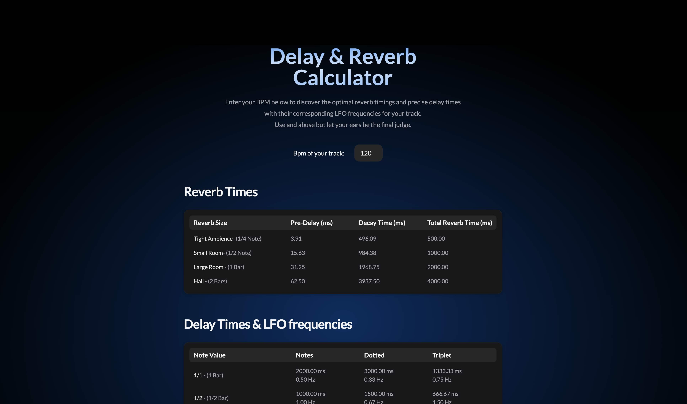

# Delay and Reverb Times Calculator

Next.js single page application for music producers. Calculates delay and times from a given song tempo

Project solely created by myself, from design to deployment through content creation and calculator logic

React, Next.js, Typescript, Framer Motion, TailwindCSS, NextUI, Google Analytics 4, deployed on Vercel.

[Go to website](https://delayreverbcalculator.com/)

## Copyright

© 2023 Jean Chane-to. All Rights Reserved.
