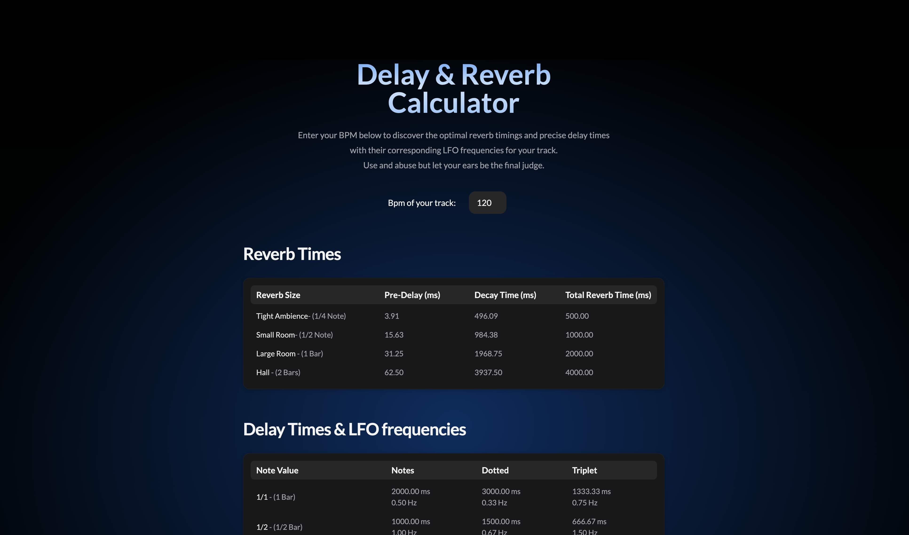

# Delay and Reverb Times Calculator

Single-page web app for music producers: enter a tempo and get tempo-synced delay times (with matching LFO frequencies) for every note value, plus pre-delay / decay / total times for four reverb sizes. Every value copies to the clipboard with one click.



[Go to website](https://delayreverbcalculator.com/)

## Stack

Next.js 16 (App Router, Turbopack, React Compiler) · React 19 · TypeScript · Tailwind CSS v4 · [HeroUI v3](https://heroui.com) · [Motion](https://motion.dev) · Vitest · Google Analytics 4 · deployed on Vercel.

## Development

```bash
pnpm install
pnpm dev          # http://localhost:3000
pnpm typecheck    # tsc --noEmit
pnpm test         # vitest — timing-domain unit tests
pnpm lint
pnpm build
```

Optional environment variable in `.env.local`:

```
NEXT_PUBLIC_GA_MEASUREMENT_ID=G-XXXXXXXXXX   # analytics are only loaded in production builds
```

## Project layout

```
src/
  app/                 routes, root layout (metadata, font, toast provider), robots, sitemap, global CSS
  config/site.ts       site identity (name, URL, description, OG image, author)
  components/          cross-feature UI (Reveal animation, SiteFooter, Analytics)
  features/
    calculator/        domain/ (pure timing math + tests) · components/ · view/
    guides/            educational accordion content + component
  lib/                 framework-free helpers (number formatting)
```

The timing math is isolated in `src/features/calculator/domain/` and covered by unit tests; UI components only format and display its output.

## Copyright

© 2023–2026 Jean Chane-to. All Rights Reserved.
